# YANT - Yet Another Note Tool

A fast, keyboard-driven markdown note-taking app with inline todos, tag organization, and a clean reading experience. Built with Go, htmx, and plain markdown files as the source of truth.

---

## Authentication

Sign in with your GitHub account. All notes are private to your account.

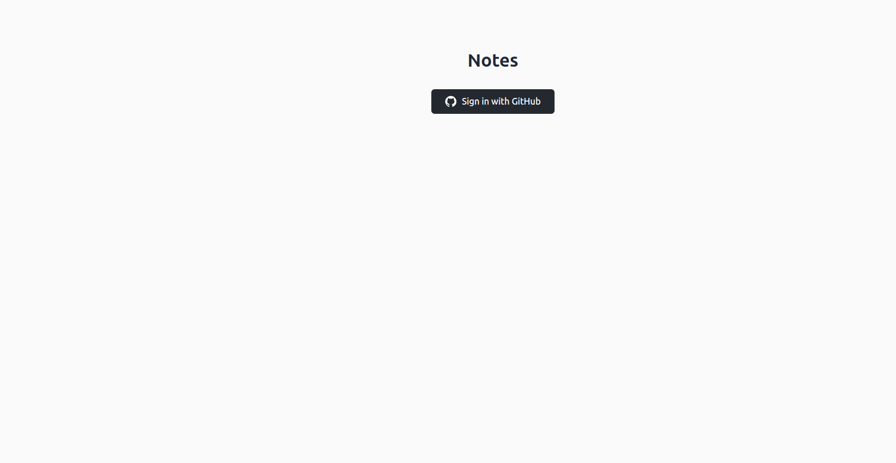

---

## Notes List

The main view shows all your notes with titles, tags, and last-modified dates. Create a new note instantly by typing a title and pressing **+ New Note**.

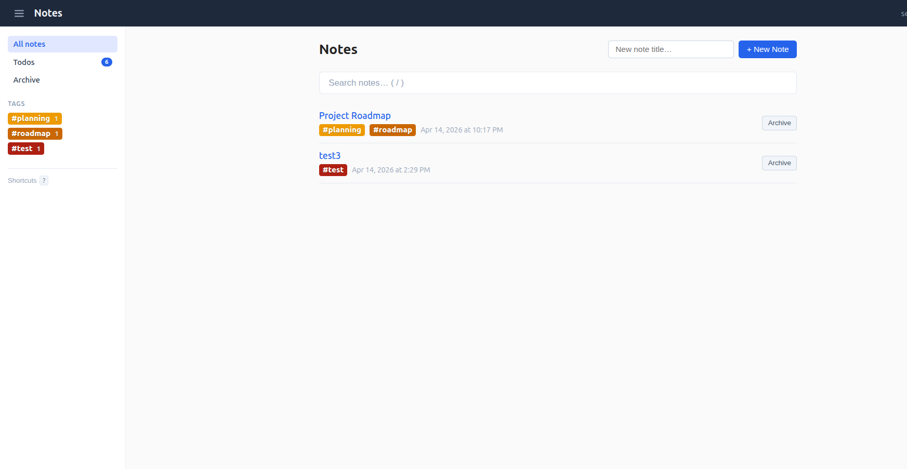

### Search

Type in the search box to filter notes by title, content, or tags. Results update live as you type. Press `/` from anywhere to jump straight to search.

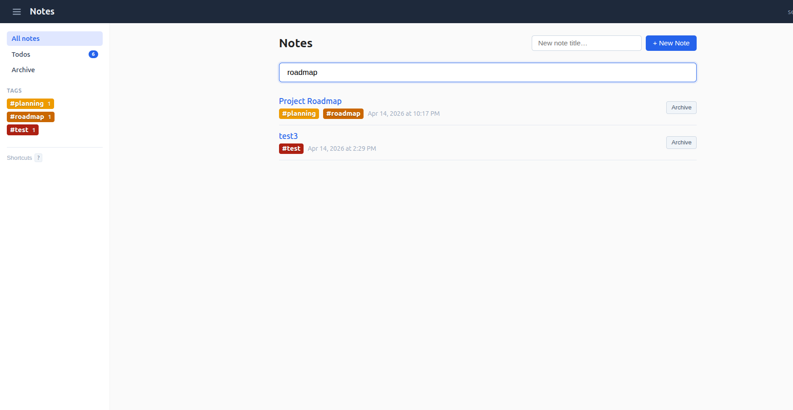

### Filter by Tag

Click any tag in the sidebar or on a note to filter the list to notes with that tag.

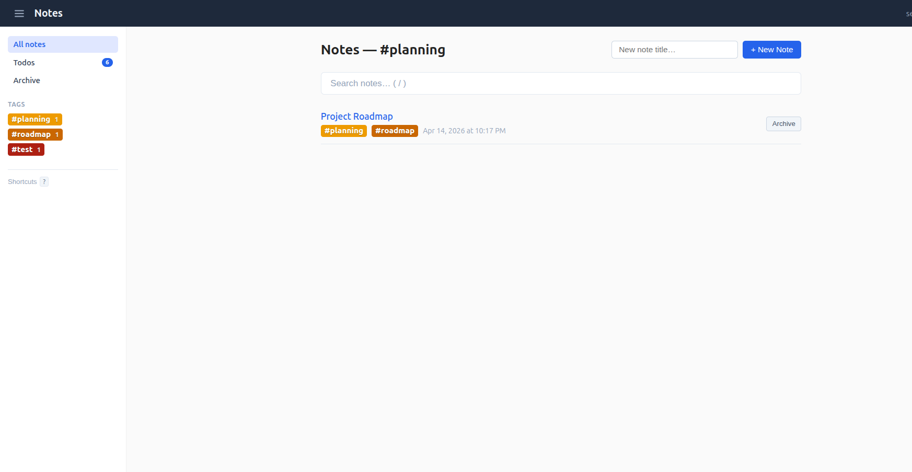

---

## Markdown Editor

A full-featured markdown editor with live preview, toolbar, and auto-save. Changes are saved automatically as you type (1.5-second debounce) with a visual "Saved" indicator.

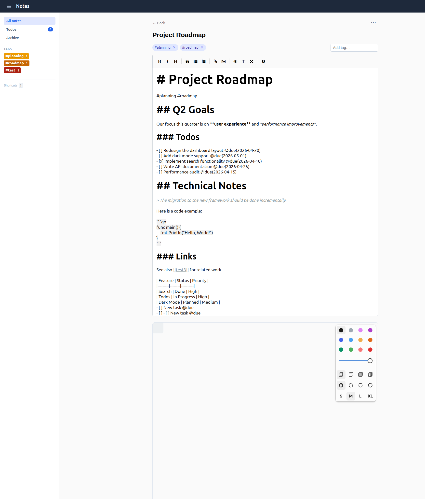

### What you can write

- **Headings**, **bold**, *italic*, and all standard markdown
- `#tags` anywhere in the body to organize notes
- `- [ ]` and `- [x]` for inline todo items
- `@due(YYYY-MM-DD)` after a todo to set a target date (triggers a date picker)
- `[[Note Title]]` to link to another note (with autocomplete)
- Fenced code blocks with syntax highlighting
- Tables, blockquotes, lists, images
- Mermaid diagrams (rendered in reader view)

### Editor Features

- **Auto-save** with status indicator (Saving / Saved / Failed)
- **Tag chips** at the top show all tags extracted from the note body
- **Image upload** via drag-and-drop or the toolbar
- **Drawing canvas** (tldraw) for sketches
- **Unsaved changes warning** prevents accidental data loss on tab close

---

## Reader View

Notes render as clean, formatted HTML with interactive elements.

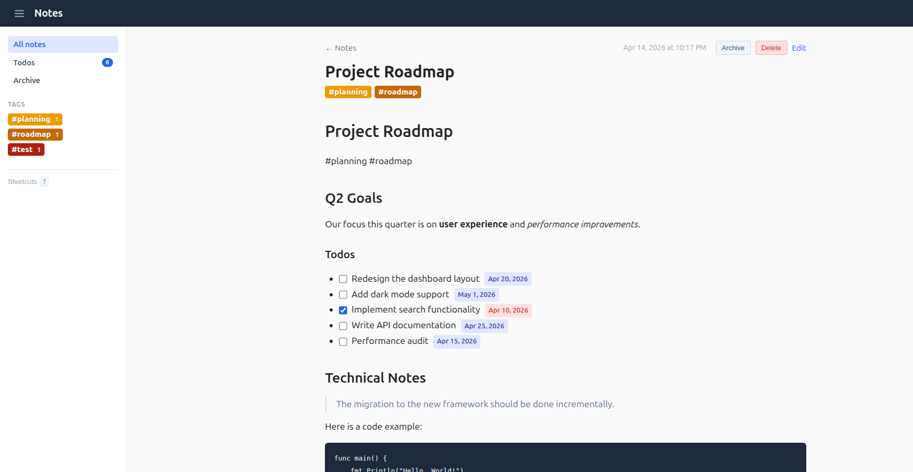

### Interactive Todos

Todo checkboxes (`- [ ]` / `- [x]`) are clickable in the reader view. Click a checkbox to toggle it — the change is saved to the markdown file instantly. Due dates appear as colored badges:

- **Blue badge** for upcoming dates
- **Red badge** for overdue items
- Completed items show with strikethrough

### Wiki-Links

`[[Note Title]]` links resolve to clickable links pointing to the referenced note. Backlinks are shown at the bottom of each note.

### Code Blocks and Tables

Fenced code blocks render with proper formatting. Tables render as styled HTML tables (GitHub Flavored Markdown).

---

## Drawing Canvas (tldraw)

Each note can have an attached drawing canvas powered by tldraw. In the editor, click **+ Add a sketch** to open a full drawing canvas with freehand drawing, shapes, colors, and stroke sizes.

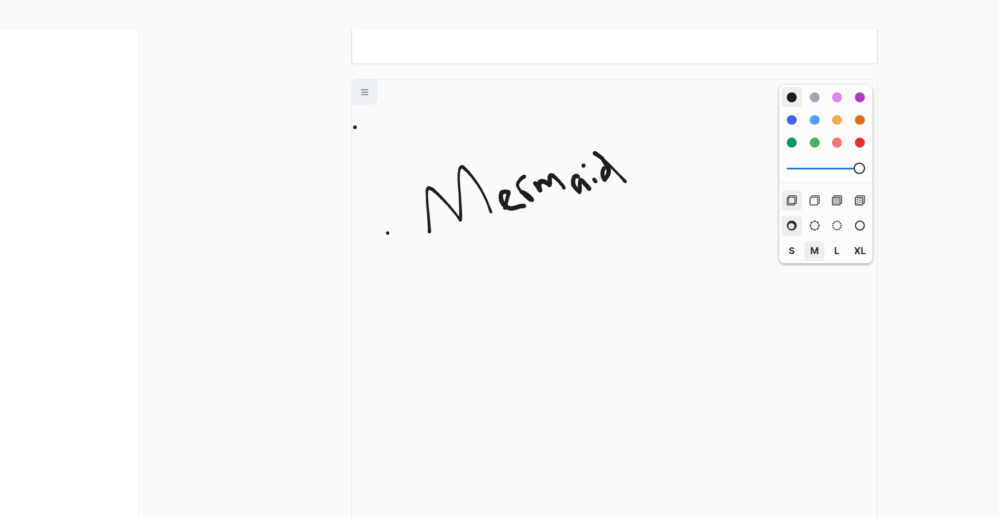

In the reader view, drawings are displayed in read-only mode — you can pan and zoom but not edit.

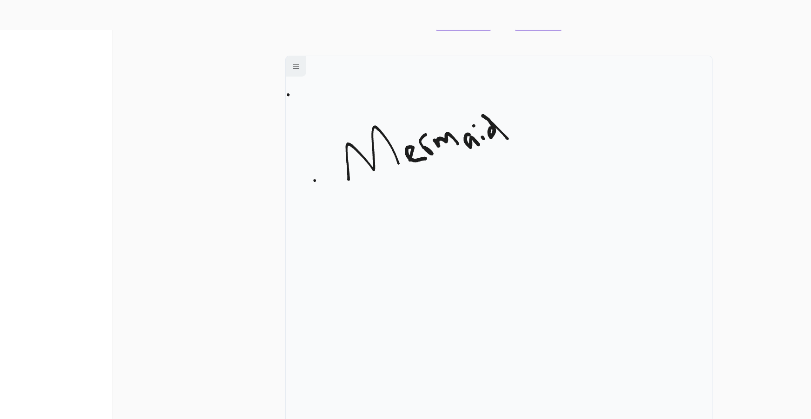

- Drawings auto-save as you sketch
- Supports freehand, shapes, text, colors, and stroke sizes
- Fullscreen mode available (Shift+F)
- Drawings are stored as JSON alongside the markdown file

---

## Todos View

A dedicated view at `/todos` aggregates all pending todo items across every note. Each item shows the task text, due date, source note (clickable), and tags.

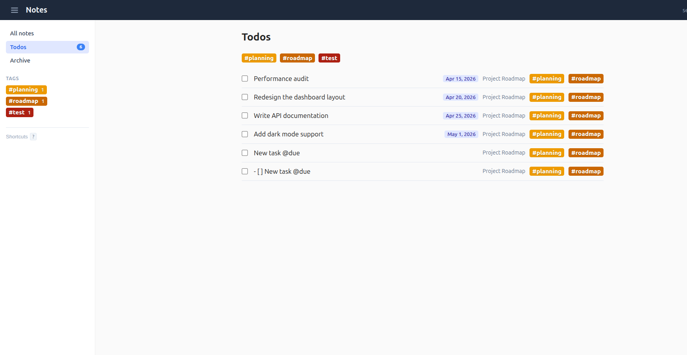

### Sorting

Todos are sorted by due date (earliest first), with overdue items at the top and undated items at the bottom.

### Filter by Tag

Click any tag pill at the top to filter todos to only those from notes with that tag.

### One-Click Completion

Click the checkbox next to any todo to mark it complete. The item fades out and the underlying markdown in the source note is updated to `- [x]`.

---

## Sidebar Navigation

A persistent sidebar provides quick access to all sections. Toggle it with the hamburger menu or the `t` keyboard shortcut.

- **All notes** - the main notes list
- **Todos** - pending todos with a count badge
- **Archive** - archived notes
- **Tags** - all tags with note counts (Ctrl/Cmd+click to change tag colors)

The current page is highlighted. Sidebar state is remembered across page loads.

---

## Archive

Archive notes you no longer need active. Archived notes are hidden from the main list and the todos view but can be restored at any time.

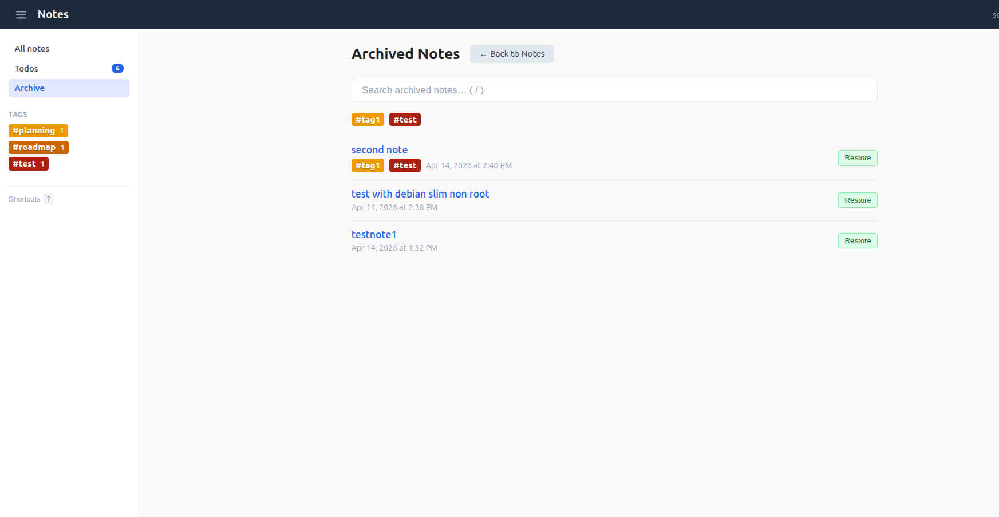

---

## Keyboard Shortcuts

Press `?` to see all shortcuts at a glance. The help modal shows `Ctrl` on Windows/Linux and the Command symbol on Mac.

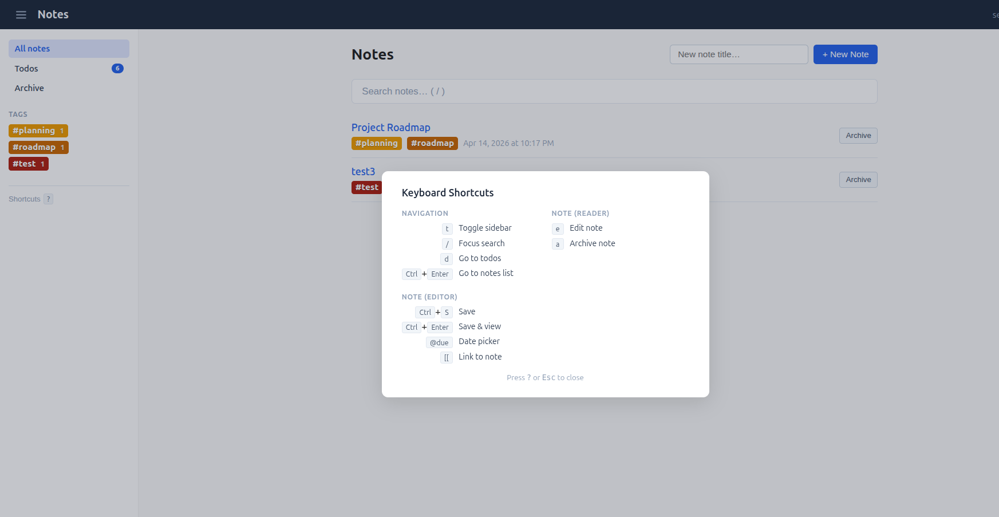

### Full Shortcut Reference

| Shortcut | Action | Context |
|----------|--------|---------|
| `t` | Toggle sidebar | Anywhere |
| `/` | Focus search | Anywhere |
| `d` | Go to todos | Anywhere |
| `?` | Show/hide shortcuts help | Anywhere |
| `Ctrl/Cmd+Enter` | Go to notes list | Reader, Todos, Archive |
| `e` | Edit note | Reader |
| `a` | Archive note | Reader |
| `Ctrl/Cmd+S` | Save | Editor |
| `Ctrl/Cmd+Enter` | Save and view | Editor |
| `@due` | Open date picker | Editor |
| `[[` | Link to note (autocomplete) | Editor |

---

## Technical Details

- **Storage**: Plain markdown files are the source of truth. SQLite is used only as a derived cache for search, tags, and todo aggregation.
- **Portable**: Copy the markdown folder to any system and retain full content.
- **Authentication**: GitHub OAuth
- **Container**: Available as a Docker image (`ghcr.io/selvakn/yant`)
- **Stack**: Go, chi, goldmark, htmx, EasyMDE, tldraw
